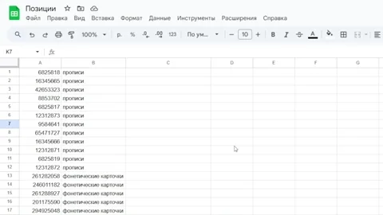
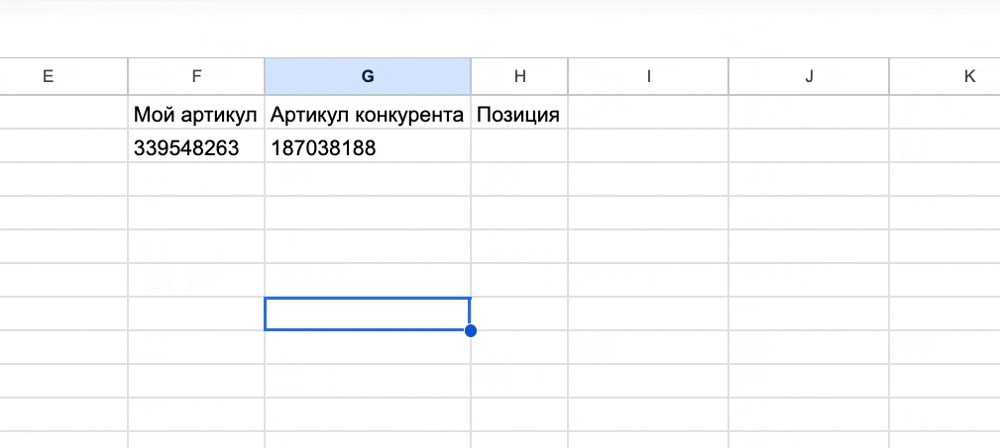

# Инструкция по использованию парсера позиций Wildberries

Этот инструмент поможет вам отслеживать позиции ваших товаров в поиске Wildberries с помощью Google Таблиц.




## 📋 Подготовка к работе

### 1. Создание Google Таблицы

1. Откройте [Google Диск](https://drive.google.com)
2. Нажмите кнопку "+ Создать" в левом верхнем углу
3. Выберите "Google Таблицы"

### 2. Настройка Google Apps Script

1. В открытой таблице перейдите в меню "Расширения" → "Apps Script"
2. В открывшемся редакторе удалите весь код
3. Скопируйте содержимое файла `WildberriesPositionFinder.gs` и вставьте его в редактор
4. Нажмите кнопку 💾 "Сохранить" (или Ctrl + S)
5. Дайте проекту название, например "WB Position Parser"
6. Нажмите "Выполнить"
7. UPD: Перейдите на клиентский вб, откройте режим разработчика (F12), найдите вкладку network, найдите запросы на WB, отфильтровав запросы по типу XHR, найдите запросы на адрес https://search.wildberries.ru/search?search=, выберите их, найтиде во вкладке Headers строку Authorization, найдите значение в нем, оно будет выглядеть как Bearer <token>, скопируйте <token> и вставьте его в переменную `authToken` в файле `WildberriesPositionFinder.gs`.
## 🚀 Использование парсера

### 1. Подготовка таблицы

1. В вашей Google Таблице создайте следующие столбцы:
   - A - Артикул
   - B - Поисковый запрос
   - C - Позиция
   - D - Артикул конкурента (Для конкурентного анализа в полках)
   - E - Позиция у конкурента

2. В ячейку для позиции введите формулу:
   ```
   =FIND_WB_POSITION(A2; B2)
   ```
   Где:
   - A2 - ячейка с артикулом
   - B2 - ячейка с поисковым запросом
   В ячейку для позиции у конкурента (E2) введите формулу:
   ```
   =FIND_REK_POSITION(A2; D2)
   ```
   Где:
   - A2 - Ваш артикул
   - D2 - Артикул конкурента

### 2. Работа с парсером

1. Введите артикул товара в столбец "Артикул"
2. Введите поисковый запрос в столбец "Поисковый запрос"
3. Формула автоматически найдет позицию товара

### Пример заполнения:

| Артикул | Поисковый запрос | Позиция |
|---------|------------------|----------|
| 123456  | платье синее     |  45    |

## 📊 Расшифровка результатов

- 🎯 123 - товар найден на позиции 123
- Нет в выдаче - товар не найден в поисковой выдаче
- ⚠️ - ошибка (обычно означает, что не заполнен артикул или поисковый запрос)
- ❌ - произошла ошибка при поиске

## ⚡ Особенности работы

- Парсер проверяет первые 3000 позиций (или 30 страниц)
- Между запросами есть задержка 1.5 секунды для избежания блокировок
- Результаты кэшируются на 30 минут для ускорения работы
- Поиск учитывает только точные совпадения артикула
- Может потребоваться замена токена авторизации

## 🔍 Советы по использованию

1. Используйте точные поисковые запросы, которые используют ваши покупатели
2. Проверяйте позиции в разное время дня
3. Для массовой проверки просто скопируйте формулу вниз по столбцу

## ❗ Возможные проблемы и их решение

1. **Формула не работает:**
   - Проверьте, что скрипт сохранен и разрешения выданы
   - Обновите страницу таблицы
   - Проверьте токен авторизации
2. **Ошибка "Нет прав":**
   - При первом использовании формулы разрешите скрипту доступ к внешним сервисам

3. **Результаты не обновляются:**
   - Подождите 30 минут (время кэширования)
   - Или очистите кэш, создав новую копию таблицы

## Благодарности

Особая благодарность [Кириллу Игнатьеву](https://github.com/kirillignatyev) и [Тимуру](https://github.com/Timur1991) за вдохновение этого проекта их первоначальными парсерами:
- [wildberries-parser-in-python](https://github.com/kirillignatyev/wildberries-parser-in-python)
- [project_wildberries](https://github.com/Timur1991/project_wildberries)
- Нейросетям за возможность создания таких инструментов

Я высоко ценю их работу и вклад в развитие инструментов для работы с Wildberries.

## 📞 Поддержка

Если у вас возникли вопросы или проблемы с использованием парсера, Добавляйтесь в чат [Telegram](https://t.me/+pOKAcasVXsU0YWQx)
